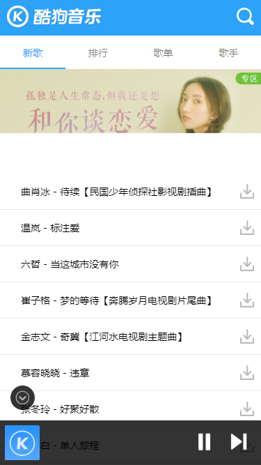
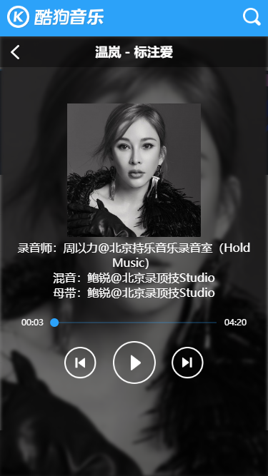

# react-kugou-demo
### 使用react仿写的酷狗音乐webapp
## 简介
1、该项目是[vue-demo-kugou](https://github.com/lavyun/vue-demo-kugou)的react重构版本。是使用react仿写的酷狗音乐webapp。   
2、本项目技术栈为 react + typescript + redux + scss + css-modules

## 在线预览
[在线预览点击此处](http://47.107.227.113:3001)，请使用手机浏览器或手机模式打开。

## 项目截图



## 如何使用
1、下载项目到本地
2、npm install 
3、修改type文件，在 node_modules/@types/react/index.d.ts 文件内添加以下type声明（详见下面注意事项）
```typescript
declare namespace React {
  interface Attributes {
    styleName?: string;
  }
}
```
4、npm run start 启动本地开发

## 注意事项
1、关于修改react的type文件：本项目使用了[babel-plugin-react-css-modules](https://github.com/gajus/babel-plugin-react-css-modules)作为css局部化的解决方案，使用时需要在jsx元素上使用styleName属性。react的jsx元素type声明文件中并没有styleName属性的声明，所以做声明合并添加styleName属性声明。如果可以能在外部type文件做声明合并更好，但是我尝试后失败了。有解决过这个问题的同学请开个issue帮忙解决，谢谢。   
2、生产环境编译（npm run build）需要先配置 src/api/index.ts 文件中的PRO_API_HOST变量

## TODO
1、对所有列表加上分页加载。

## 本人的其他项目，欢迎star ^^
* [mpvue-fresh-weather](https://github.com/aasailan/mpvue-fresh-weather)：基于typescript + mpvue 的天气类型微信小程序
* [egg-nideshop](https://github.com/aasailan/egg-nideshop)：基于typescript + eggjs + Sequelize + mysql 的开源小程序后台。
* [react-kugou-demo](https://github.com/aasailan/react-kugou-demo)：基于typescript + react + redux + scss 的仿酷狗音乐webapp
